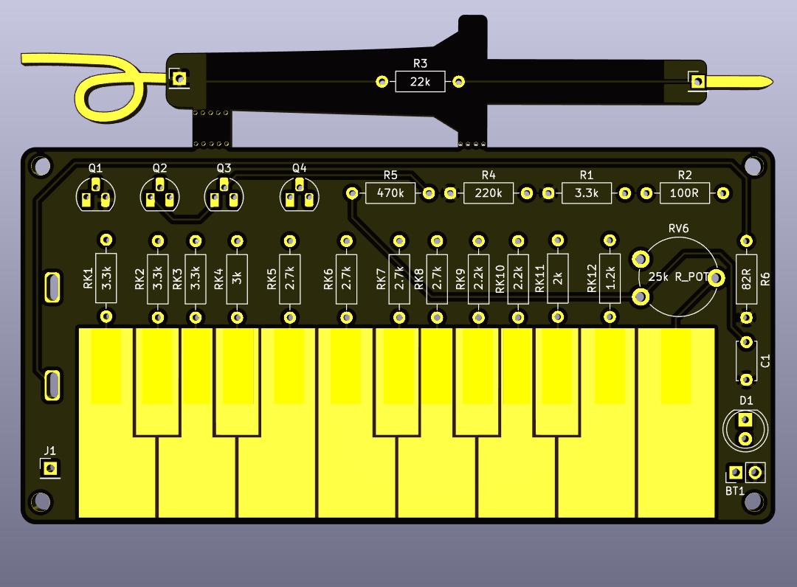
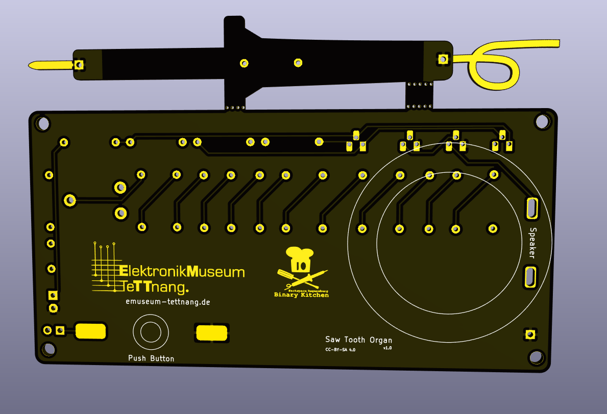

Saw Tooth Organ - DIP

Some Transistors creating a saw tooth wave enabling a very simple organ which you can play.

 

- Status: **Complete**
- Difficulty: **2/5**

### Parts List

| Amount | Name         | Description                        |
|--------|--------------|------------------------------------|

TBD

### Manual
You can find the manual and pictures of every step here: https://github.com/Binary-Kitchen/SolderingTutorial

### Copyright and Authorship

- Board: [CC-BY-SA 4.0](https://creativecommons.org/licenses/by-sa/4.0/) - Timo Schindler
- Idea and scheme: [CC-BY-SA 4.0](https://creativecommons.org/licenses/by-sa/4.0/) - [Elektronikmuseum Tettnang](http://www.emuseum-tettnang.de/)

### Soldering Kit without PCB
If you don't have the PCB but can get the parts you can also use this manual: TBD